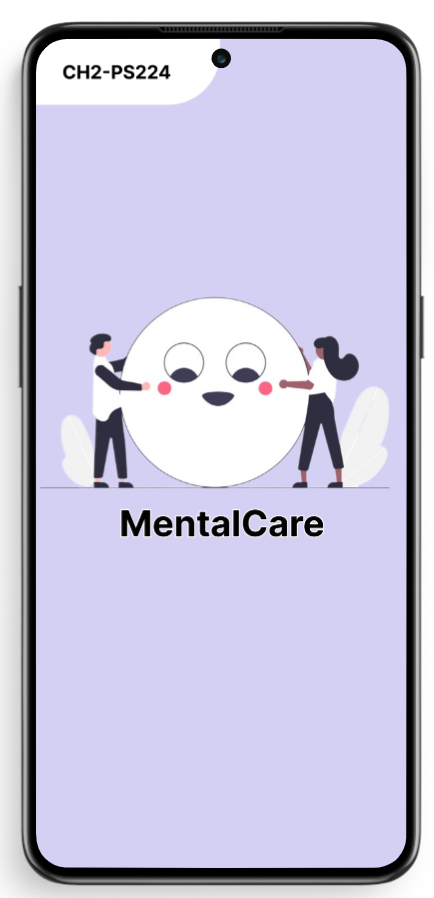
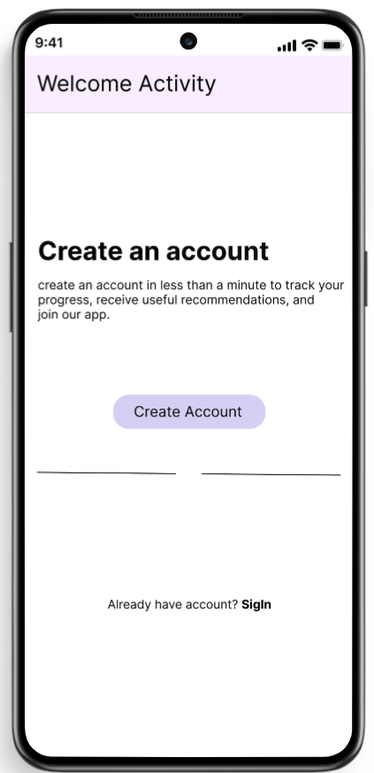
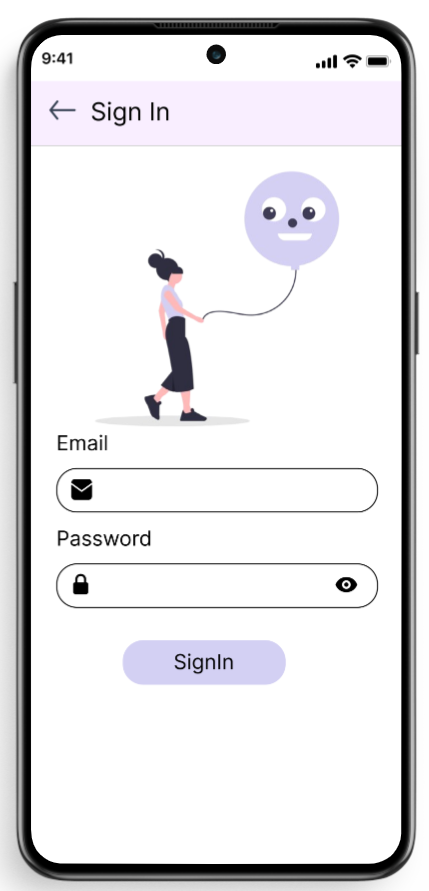
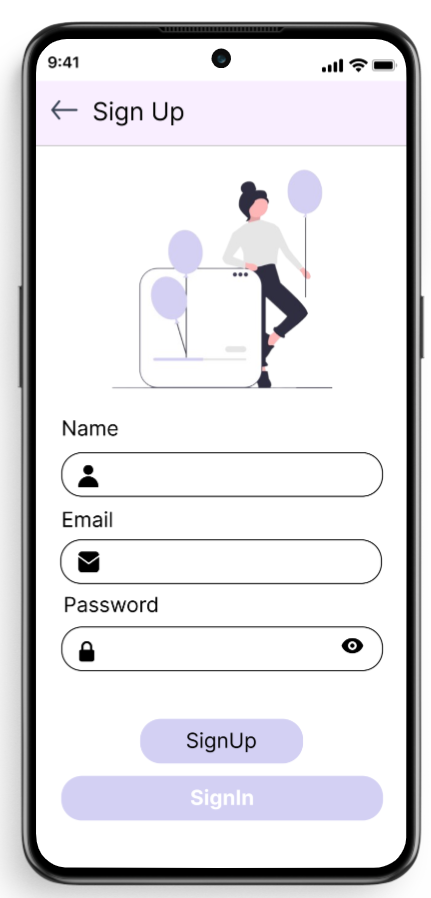
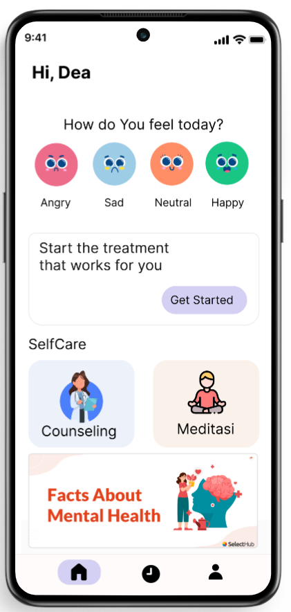
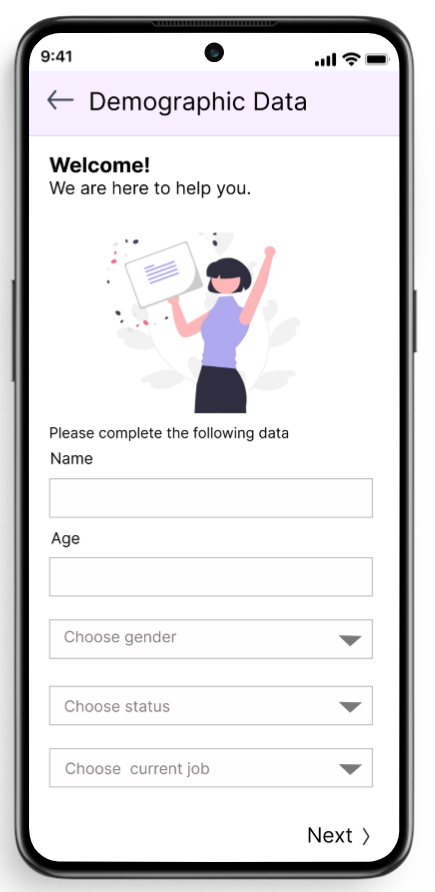
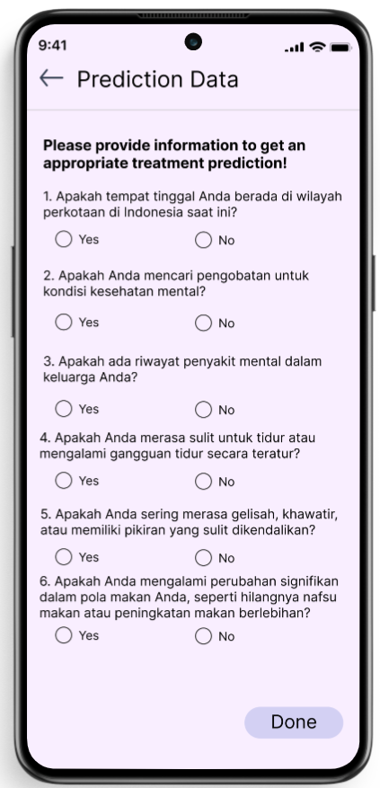
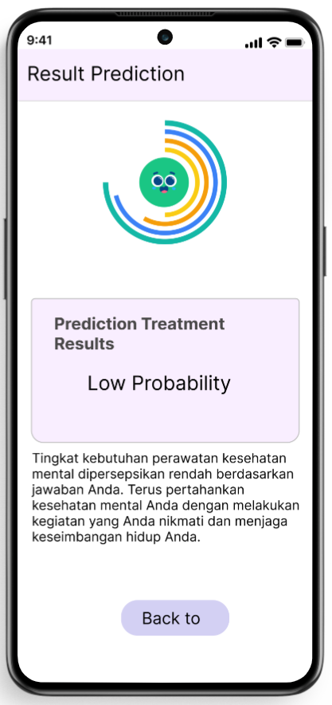
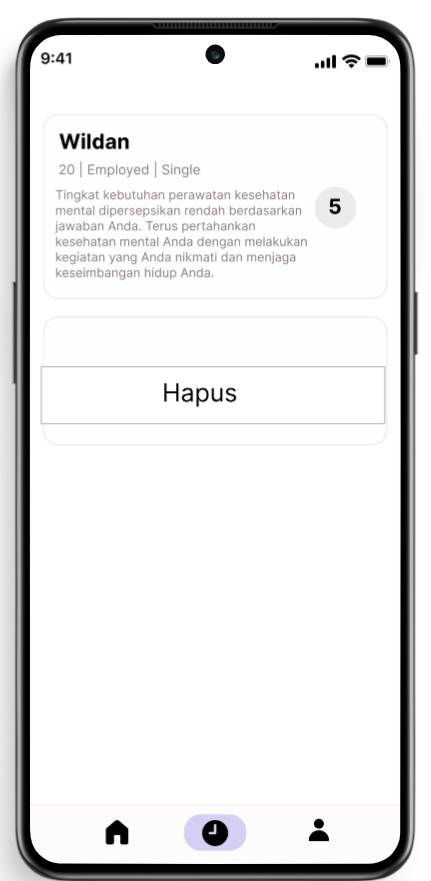
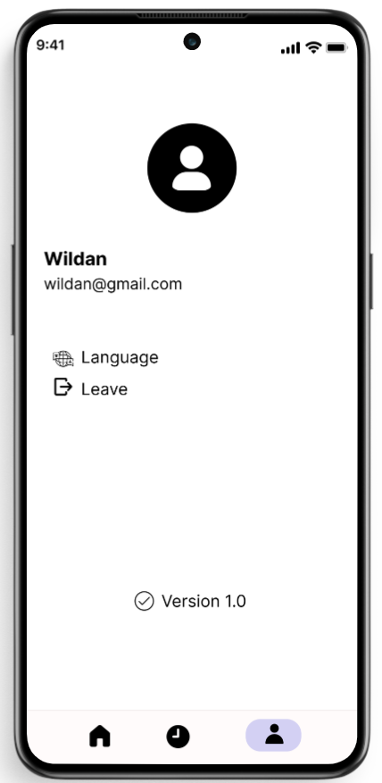

# MentalCare - Treatment prediction app for Anxiety and Depression disorders
MentalCare is a mental health app designed to provide holistic solutions through personalized treatment predictions. The app incorporates Machine Learning technology to provide treatment that is responsive and tailored to individual needs.
## Key Features

- **Personalized Medicine Prediction:** Using Machine Learning to provide treatment recommendations that match the user's mental state.
- **Intuitive User Interface:** User interface design that is user-friendly and easy to use.
- **Development History:** Track and review treatment history to monitor progress.
## Design UI

    
    
    

    
    
    

    
    
    

    

---
© 2023 MentalCare Team
